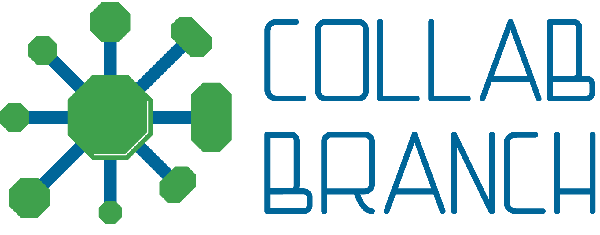

  

<h1 align="center">
    Collab Branch - Repositório de Materiais
</h1>

  
  

## :clipboard: Descrição

O **Repositório de Materiais** é um projeto open source do time de desenvolvimento **Collab Branch** [Ramo Estudantil IEEE do IFPB-CG](https://github.com/ieeeifpbcg).  
O seu proposito é criar repositórios com materiais de estudo para todas as disciplinas dos cursos superiories de Tecnologia em Telemática e Engenharia de computação.

## :man: Criadores

<table style="width:100%">

  <tr>
    <td style="width:50%" align="center">
<h3>Arthur Mauricio</h3>

Desenvolvedor Graduando em Engenharia de Computação - IFPB
</td>
    <td style="width:50%"align="center">
<h3>Felipe Ferreira</h3>

Desenvolvedor Graduando em Telemática - IFPB
</td>
  </tr>
</table>

## 🧐 O que tem dentro?

### Tecnologias
- [Gatsby](https://www.gatsbyjs.org/)
- [MDX](https://mdxjs.com)
- [Styled Components](https://styled-components.com)
- [ReactJS](https://reactjs.org/)

### Ferramentas de Linter
- [Eslint](https://eslint.org/)
- [Prettier](https://prettier.io/)
- [Commitlint](https://commitlint.js.org/#/)
- [Commitizen](http://commitizen.github.io/cz-cli/)

